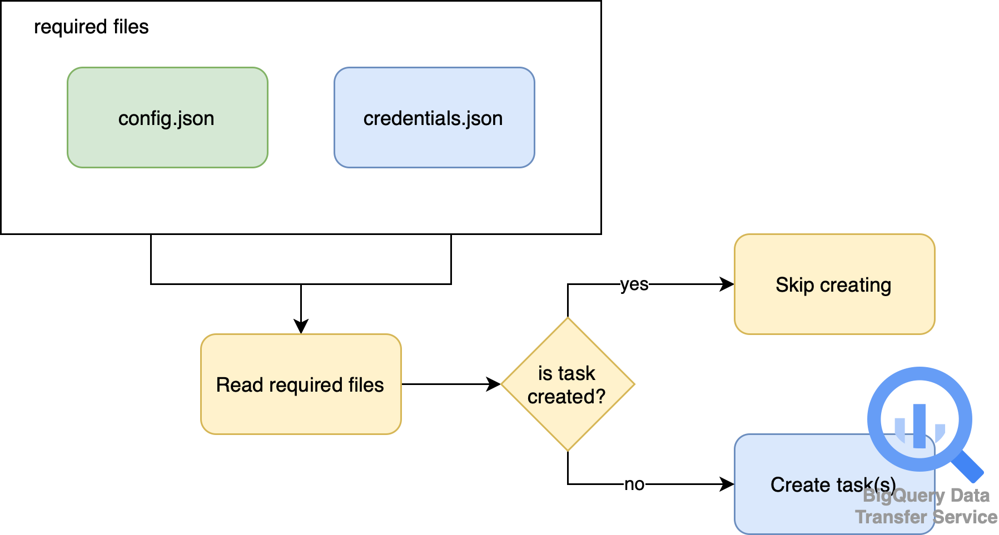

# BIGQUERY CREATE DATA TRANSFER
## What Is This For?
This program is to create data transfer task in GCP BigQuery. Commonly, when we create new data transfer task in BigQuery, it will use our personal/work credential/email. Once we left the company and our work credential is deactivated, the task that was created with our credential will stop and return error.

So the goal is to create automatically using this script and using IAM service provided to create data transfer task. Therefore, once our credential is deactivated, it will keep running the task. The task that is created is detached to our work credential.



## What Is In It?
There are 3 python files lie here.
- `logger.py` is the file contains a logger object to provide logs generated by the program. If anything happens, you can debug the program right from the generated logs.
- `helpers.py` is the file contains functions that can help us to create the task in BigQuery Data Transfer.
    - `is_file_exist`: check whether the `config.json` is already provided or not.
    - `list_dts`: returns the list of created tasks in BigQuery Data Transfer.
    - `create_dts_s3`: create the task in BigQuery Data Transfer.

## What Is Required To Setup?
- You need to set a `.env` file to provide every configuration needed by the program to run. Below is the variables needed to provide in the file.
    ```
    # GCP CREDENTIALS
    GOOGLE_APPLICATION_CREDENTIALS=iam-service-credential-file
    PROJECT_ID=your-gcp-project-id
    LOCATION=your-gcp-project-location

    # AWS CREDENTIALS
    ACCESS_KEY_ID=your-aws-access-key
    SECRET_ACCESS_KEY=your-aws-secret-access-key
    ```
- Generate IAM service credential file from GCP that has access to create data transfer in BigQuery.
- Create a `config.json` file that contains configurations as below.
    ```json
    [
        {
            "display_name": "display name of the task",
            "destination_dataset": "destination dataset",
            "destination_table": "destination table",
            "s3_uri": "s3 path of where data in parquet format stored"
        },
        {
            "display_name": "display name of the task",
            "destination_dataset": "destination dataset",
            "destination_table": "destination table",
            "s3_uri": "s3 path of where data in parquet format stored"
        }
    ]
    ```
    You can add other configurations as above example.

⚠️ **DO NOT PUSH YOUR `.env` AND GCP CREDENTIAL FILES INTO REPOSITORY SINCE IT IS CREDENTIAL!!**

## How To Run The Program?
I suggest you to use python virtual environment to separate the environment between project. You can find how to create and use it in [python documentation page](https://docs.python.org/3/library/venv.html).

After activating virtual environment, please follow below steps.
1. You need to install all the dependencies required. All dependencies are provided in file `requirements.txt`. To install this, you can run the command below.
    ```
    pip install -r requirements.txt
    ```
2. Run the script by writing below command in the shell.
    ```
    python main.py
    ```